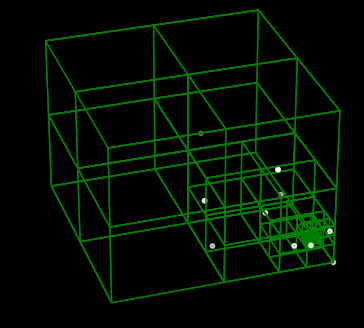

# Algoritmo Barnes-Hut tridimensional

El presente trabajo corresponde al segundo proyecto de la materia Astrofísica Computacional para el periodo 2023-2. El mismo consiste en la implementación del algoritmo de Barnes-Hut para la solución del problema de N cuerpos en tres dimensiones.

## Implementación

### Creación del árbol (estructura de aceleración)

La implementación realizada crea un árbol de nodos para el cual por cada nodo hay máximo una partícula o un conjunto de ocho (8) nodos, cada uno de los cuales puede a su vez contener máximo una partícula (para la implementación descrita por Barnes y Hut, aunque en nuestra implementación, el número de partículas permitidas por nodo puede ser alterado a voluntad). 

Para la creación del árbol, el el archivo ``Geometry.py`` se declaran inicialmente las clases ``Vector`` y ``Cuboid``. La clase ``Vector`` nos servirá para definir un vector tridimensional con atributos ``x``, ``y``, y ``z`` que se usará posteriormente para, en la clase ``Cuboid`` definir el origen de cordenadas de la región rectangular a la que estará asociada cada objeto de la misma clase. La clase ``Cuboid``, por su lado, comprende la definición de una región rectangular asociada a un árbol, con anchura, profundidad y altura ``width``, ``depth`` y ``height``, esta región rectangular estará asociada porsteriormente a un nodo (objeto de la clase ``TreeNode``).

En el archivo ``Tree.py`` se encuentra la definición de la clase ``TreeNode``, que corresponde a los objetos que conformarán el árbol (Octree). Cada clase, almacena un número de partículas según lo defina el argumento ``capacity``, y tendrá asociada una región rectangular definida en el argumento ``boundaries``, un objeto de la clase ``Cuboid``. Cada nodo posee, a su vez, el atributo ``StoredData`` donde se encuentran almacenados los objetos (clase ``Particles`` en nuestro caso), que este mismo contiene; el atributo ``divided`` que guardará la información sobre si el nodo ha sido previamente divido en ocho subnodos, o hijos, que se encuentran definidos en el atributo ``childs``.

Cada nodo tiene, además, un atributo correspondiente a su centro de masas (que se calcula para todas las partículas contenidas en la región del espacio que el nodo ocupa) y la masa total albergada, que son utilizados. Para la realización de cada interacción se tiene que si la razón entre el volumen del espacio correspondiente al nodo y la distancia entre la partícula y el centro de masas del nodo es menor que 0.5 (maximun acceptance criterion), la interacción con todas las partículas al interior del nodo se toma como una sola interacción, la correspondiente a su centro de masas.

### Condiciones Iniciales

El programa implementado contiene a su vez un generador de condiciones iniciales que genera condiciones inciales para cuerpos que orbitan un cuerpo central masivo (i.e. con una masa mucho mayor a cualquier partícula que lo orbita.  El generador toma en cuenta la condición dada por el potencial eficaz la cual expresa que E/m < 0. Basado en esto, se genera una posición aleatoria generando inicialmente un valor de distancia r (no alguna componente) cuyo valor se encuentra entre dos valores a y b positivos, de esta forma se evita generar partículas con condiciones muy cerca al cuerpo central masivo que puedan caer rápidamente hacia él. Dado el valor de r se generan los valores de la componente x y la componente y, quedando la tercera componente determinada. Teniendo esto, con la condición impuesta por la física del problema, se genera un valor de la magnitud de la velocidad dada por dicha condición, se generan también dos componente aleatorias quedando la tercera determinada. Con dicha estrutura el generador, que recibe como argumentos el número de condiciones iniciales a generar y la masa del cuerpo masivo central, genera las condiciones pedidas que cumplan con la descripción de órbitas cerradas.

### Maximum acceptance criterion (MAC), y la evolución temporal

Una vez se han generado las condiciones iniciales, de forma recursiva se crea un árbol en el que todas las partículas son insertadas, y se crean las divisiones correspondientes. Para cada partícula, se inicia comprobando la condición $s/d \geq 0.5$, donde, si se cumple esta condición, se pasa a examinar la interacción de  la partícula con cada uno de los 8 nodos hijos. En el caso en que un nodo contenga una sola partícula o que $s/d \leq 0.5$, se procede a sumar la aceleración generada por la interacción con dicho nodo como la interacción con un cuerpo con la masa contenida por el nodo en la posición de su centro de masas, en este caso, el algoritmo se degenera al algoritmo de fuerza bruta. De esta forma, se realiza el procedimiento para cada partícula obteniendo la aceleración correspondiente, con dicho valor de la aceleración es posible, mediante una integración tipo Verlet, obtener la evolución temporal de la partícula.

## Resultados

La implementación hecha no resultó satisfactoria según los resultados esperados. Los métodos implementados generan correctamente, de forma recursiva, el árbol de nodos y las condiciones iniciales para definir un conjunto de partículas con una distribución espacial aleatoria y una distribución kepleriana de velocidades, pero las interacciones entre cuerpos no fueron logradas en el presente trabajo.

Bajo una actualización y mejora del algoritmo, esperamos obtener gráficas como las que se encuentran en los archivos animados ``SA*.gif``, y ``SA*1.gif``, correspondientes a la órbita de treces (13) estrellas del clúster de Sagitario A*, el agujero negro supermasivo en el centro de La Vía Láctea. Los datos para estas animaciones fueron generados usando la implementación del mismo algoritmo Barnes-Hut presentada previamente en clase, que se encuentra en el archivo ``main.py``, y las animaciones fueron posteriormente generadas con el archivo ``movie.py``, ambos archivos en la carpeta ``imp``.
